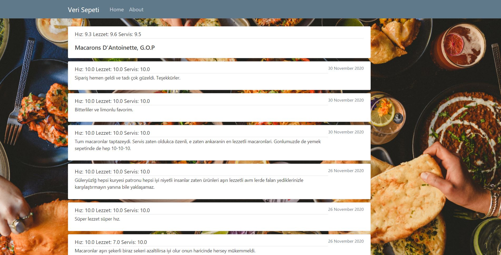

# Veri Sepeti

Gerekli paketleri yüklemek için:

```
pip install -r requirements.txt
```

Projeyi doğru bir şekilde çalıştırmak için aşağıdaki drive klasöründen "db.sqlite3" dosyasını indirip manage.py dosyasının olduğu konuma koymanız gerekmektedir.

https://drive.google.com/drive/folders/1__V2O7Usi6AYUb_ghUvcmHoCYRMnFbTb?usp=sharing

Daha sonra manage.py scriptini şu şekilde çalıştırarak localde django projesini aktif hale getirmelisiniz.

```
python manage.py runserver
```

Web uygulamasını kullanmak için tarayıcıdan http://127.0.0.1:8000/ adresine gitmelisiniz.

**NOT: Kullanıcı arayüzü farklı tarayıcılar için farklı sonuçlar verebiliyor. Ben google chrome kullanarak çalıştım genelde ve bir sıkıntı ile karşılaşmadım. Bu nedenle google chrome kullanılmasını tavsiye ederim.**

Uygulamanın ana sayfası aşağıdaki gibidir. Kullanıcıya iki farklı seçenek sunulmuştur. (Getir/Keşfet)

Getir'e basıldığında girilen parametrelere göre veriler çekilerek veri tabanına ekleme yapılır. (Bu işlem çok uzun sürebileceği için iki farklı işlem olarak ayarladım.) Bu işlem bittiğinde bir popup mesajı çıkarak işlemin bittiğini söyler. Aynı zamanda terminal ekranından işlemin çıktılarını da görebilirsiniz.

Keşfet'e basıldığında ise, mevcut veriler üzerinden filtreleme yapılarak restoranlar listelenir.


Restoranların listelendiği sayfa aşağıdaki gibidir. Sağ üstten yemek seçerek önerilen restoranların bulunduğu sayfaya gidebilirsiniz veya cluster tuşuna tılayarak öbeklenen restoranların bulunduğu sayfaya gidebilirsiniz. Restoranların isimlerinin üstüne tıklayarak, o restoranın detaylı bilgilerinin bulunduğu sayfaya ulaşabilirsiniz.


Restoran detaylarının bulunduğu sayfadan yorumlara erişebilirsiniz.

Restoran bilgilerinin sayfası:


Restoran yorumlarının bulunduğu sayfa:




K-means kullanılarak bölünen restoranların sayfası aşağıdaki gibidir. Bu sayfada görsel olarak restoranların karşılaştırmasını yapabilirsiniz.


Yukarıda paylaştığım drive klasöründe ayrıca bir de colab notebook var. Bu notebookta şu ana kadar çektiğim tüm verileri kullanarak bir takım işlemler gerçekleştirdim.
Her bir restoranın yorum sayısı, yorum puanları, yemek sayısı ve fiyatları, günlük yorum sıklığına göre restoranlar için bir clustering uyguladım.
Elimdeki veriye göre elbow metodunu kullanarak en uygun sayıda cluster sayısını (3) çıkarttım ve buna göre k-means algoritmasını çalıştırdım. Colab notebookunda bunu nasıl yaptığımı görebilirsiniz.
Bunlara ek olarak, bir yemek önerisi algoritması geliştirdim. Seçtiğiniz yemek için, geliştirdiğim algoritmadan alınan skorlara göre en iyiden en kötüye sıralayarak bir restoran listesi veriyor. Bu algoritma yorumlarda geçen yemeklerin, yorum puanına ve sıklığına göre bir skor hesaplıyor ve en iyi skorları listeliyor. Algoritmanın nasıl hesaplandığı colab notebookunda mevcuttur.

Yemek puanı şu şekilde hesaplanmaktadır:

Yemek puanı = (yapılan yorumun ortalama puanı * 0.5) + ((yemeğin yorumlarda geçme sayısı * 0.5) / 6.9)

Not: 6.9 değeri tüm restoranlardaki yemeklerin sıklığının ortalaması alınarak bulunmuştur. Normalize etmek için kullanılıyor.

Aşağıdaki grafikte neden 3 cluster seçtiğimi görebilirsiniz. Tam net olmasa da 3. noktadan sonra daha düz bir çizgiye yönelim var, bu nedenle 3 cluster olacağını düşündüm.


